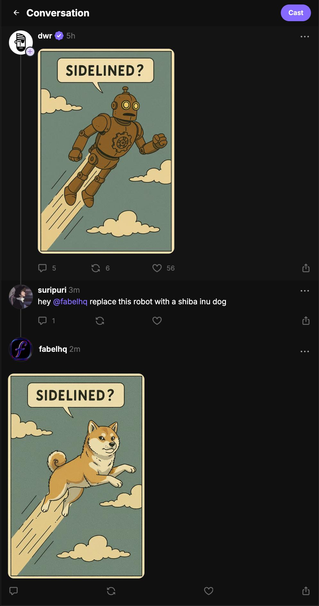
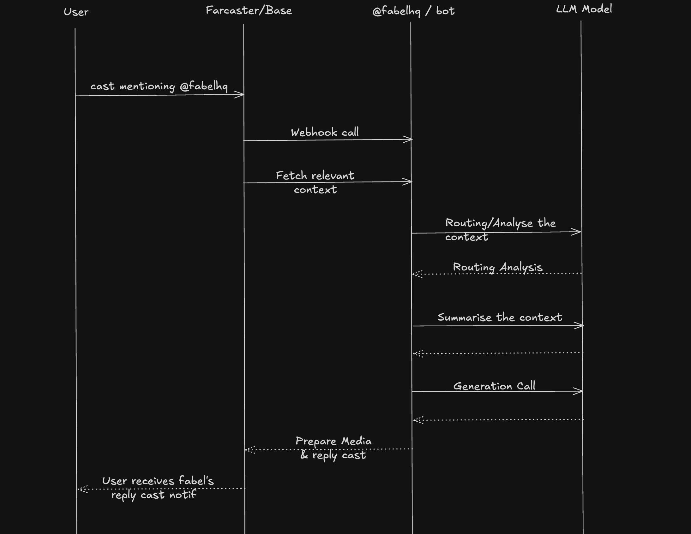
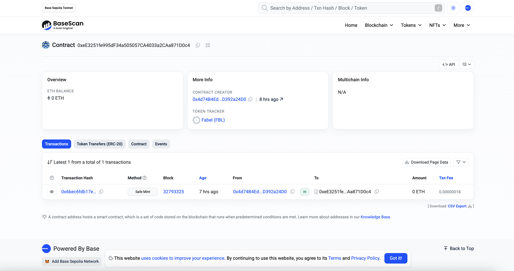

.png)
# Fabel : 
Making it fun for creators to create on chain

Fabel is a conversational AI-powered image generation platform that integrates with Farcaster social protocol. 

Just tag the bot **@fabelhq** on farcaster & it will generate your idea to reality.



## Project Architecture

This monorepo contains three interconnected modules:

### 🤖 Bot (`/bot`)
The Farcaster bot service that processes mentions and generates AI-powered responses.

**Key Features:**
- Webhook handler for Farcaster cast mentions
- Context extraction from conversation threads
- Queue-based job processing with idempotency
- AI image/text generation via SDK integration
- CDN upload and social media publishing

**Core Components:**
- `index.ts` - Express server handling webhooks
- `queue/` - Job queue system with idempotency controls
- `services/` - Context extraction, generation, and publishing services
- `utils/` - CDN, logging, and Neynar client utilities

### 📱 Mini-App (`/mini-app`)
A Next.js-based Farcaster Frame application for interactive content creation and minting.

**Key Features:**
- Farcaster Frame integration with auth
- Wallet connectivity (Wagmi, Solana)
- NFT minting interface
- Modern React UI with Tailwind CSS
- Vercel deployment ready

**Structure:**
- `src/app/` - Next.js app router pages and API routes
- `src/components/` - Reusable UI components and providers
- `src/hooks/` - Custom React hooks for auth and interactions
- `scripts/` - Deployment and development utilities

### 🛠️ SDK (`/sdk`)
The core AI generation SDK powering both the bot and mini-app.

**Key Features:**
- Conversational context processing
- Multi-modal AI generation (text, image, video)
- Google Vertex AI integration
- Type-safe conversation handling
- Modular generation services

**Architecture:**
- `src/services/` - Generation services (image, text, video)
- `src/services/analysis/` - Conversation analysis and summarization
- `src/types/` - TypeScript definitions for conversation handling
- `src/utils/` - Image processing helpers

## Sequence Diagram 



## Technology Stack

- **Backend**: Node.js, Express, TypeScript
- **Frontend**: Next.js, React 19, Tailwind CSS
- **AI**: Google Vertex AI, Gemini models
- **Blockchain**: Wagmi, Viem, Solana adapters
- **Social**: Farcaster protocol, Neynar SDK
- **Infrastructure**: Vercel, CDN storage, pnpm workspaces

## Development Setup

This project uses pnpm workspaces for monorepo management. Each module can be developed independently while sharing common dependencies.

```bash
# Install dependencies in each module
pnpm install 

# Run bot in development
cd bot && pnpm dev

# Run mini-app in development  
cd mini-app && pnpm dev

# Build SDK
cd sdk && pnpm build
```

## Fabel Factory Contract
Base Contract deployment details: 
https://sepolia.basescan.org/address/0xeE3251fe995dF34a505057CA4033a2CAa871D0c4
